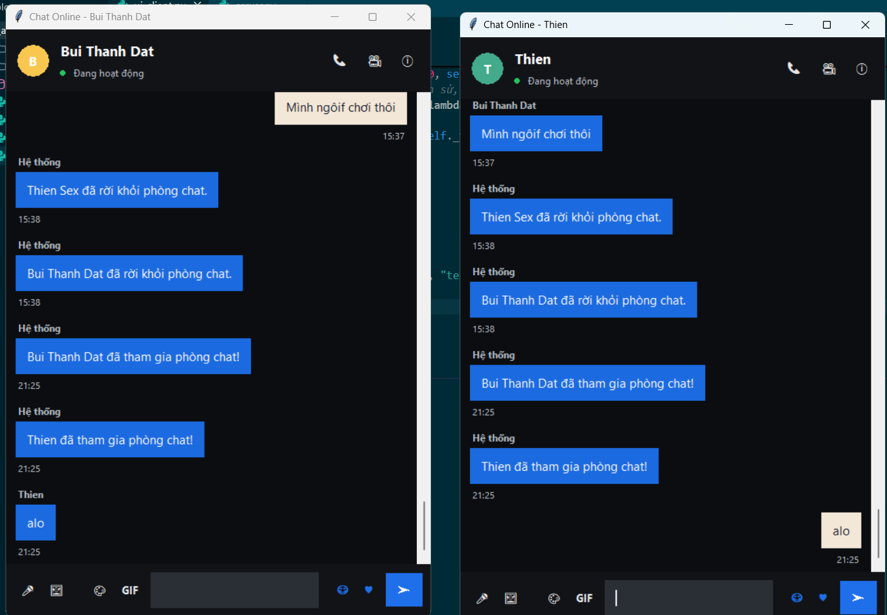

# 💬 Chat Server Application (Python)

## 📌 Giới thiệu

Đây là dự án xây dựng **hệ thống Chat Server thời gian thực** sử dụng ngôn ngữ **Python**.
Hệ thống được thiết kế theo mô hình **Client – Server** cho phép nhiều người dùng kết nối và gửi tin nhắn cùng lúc.

Dự án được thực hiện nhằm mục đích:

* Nghiên cứu **Socket Programming**
* Hiểu cơ chế **TCP/IP**
* Áp dụng **Multi-threading**
* Xây dựng **ứng dụng mạng thời gian thực**

---

# 🏗 Kiến trúc hệ thống

Hệ thống sử dụng mô hình:

Client → Server → Client

Mọi tin nhắn từ client sẽ gửi tới **Server**, sau đó server sẽ phân phối lại cho các client khác.

---

# ⚙️ Công nghệ sử dụng

* Python
* Socket Programming
* TCP/IP Protocol
* Threading (Multi-thread)
* Tkinter (GUI)

---

# 📂 Cấu trúc project

```
chat-server-project
│
├── server.py          # Chương trình Server
├── client.py          # Chương trình Client
├── gui_client.py      # Giao diện Tkinter
├── database.py        # Quản lý dữ liệu (nếu có)
│
├── images             # Ảnh demo
│
└── README.md
```

---

# 🚀 Cách chạy chương trình

## 1️⃣ Chạy Server

```bash
python server.py
```

Server sẽ chạy tại:

```
127.0.0.1:55555
```

---

## 2️⃣ Chạy Client

```bash
python client.py
```

---

# 💡 Chức năng hệ thống

* Kết nối nhiều client
* Gửi và nhận tin nhắn
* Chat thời gian thực
* Hiển thị danh sách người dùng

---

# 🧪 Kiểm thử

| Test Case             | Kết quả          |
| --------------------- | ---------------- |
| Client kết nối Server | Thành công       |
| Gửi tin nhắn          | Thành công       |
| Nhiều client          | Server xử lý tốt |

---

# 📷 Demo



---

# 👨‍💻 Tác giả

Sinh viên: Bùi Thành Đạt
Môn học: Điện toán di động / Lập trình mạng

---

# 📄 License

Project phục vụ mục đích **học tập và nghiên cứu**.
